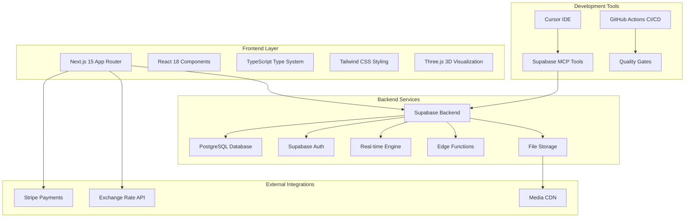
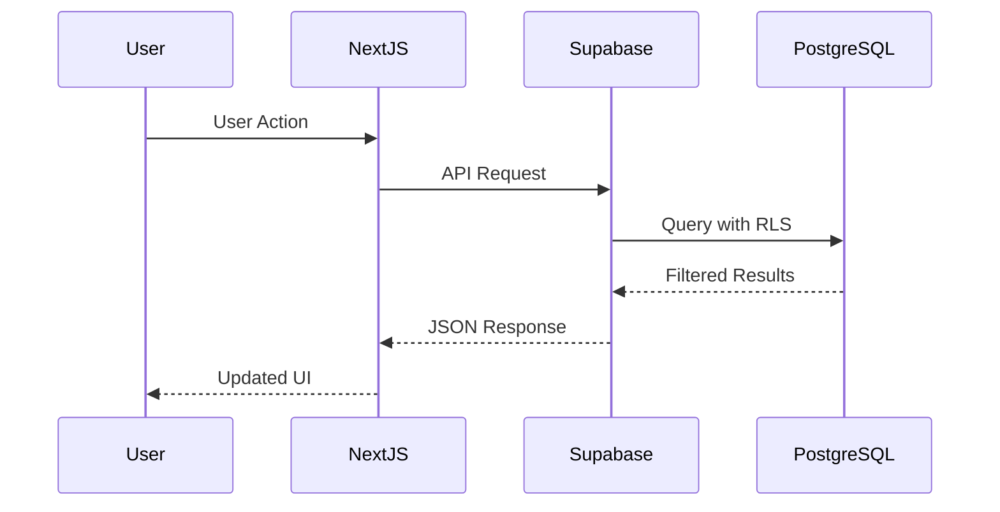
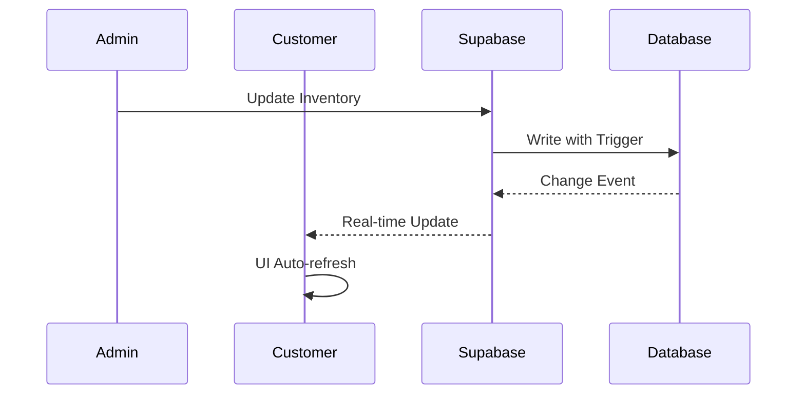
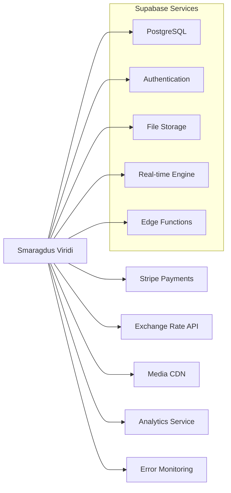

# 🏗️ System Architecture Overview - Smaragdus Viridi

**Document Status**: ✅ Complete  
**Last Updated**: January 2025  
**Architecture Pattern**: Feature-Based with Domain-Driven Design

---

## 🎯 Architecture Goals

### Primary Objectives

- **Scalability**: Support growing gemstone inventory and user base
- **Performance**: Sub-2s page loads, real-time features
- **Security**: Enterprise-grade security for high-value transactions
- **Maintainability**: Clean, modular code with clear boundaries
- **Developer Experience**: Fast development cycles with quality guarantees

### Architecture Principles

1. **Feature-Based Organization** - Code organized by business domains
2. **Type Safety First** - Comprehensive TypeScript throughout
3. **Database-First Security** - Row Level Security (RLS) at database level
4. **Real-time by Design** - WebSocket connections for live updates
5. **Performance-Optimized** - Built-in optimization patterns

---

## 🏢 High-Level Architecture



---

## 📂 Feature-Based Architecture

### Directory Structure

```
src/
├── features/                    # Business domain features
│   ├── gemstones/              # Gemstone catalog & management
│   │   ├── components/         # UI components
│   │   ├── hooks/              # React hooks
│   │   ├── services/           # Business logic & API calls
│   │   ├── types/              # TypeScript definitions
│   │   └── utils/              # Feature utilities
│   ├── authentication/         # User auth & management
│   ├── cart/                   # Shopping cart functionality
│   ├── orders/                 # Order processing
│   ├── chat/                   # Real-time customer support
│   ├── visualization/          # 3D ring visualization
│   ├── media/                  # File upload/management
│   ├── currency/               # Multi-currency system
│   └── admin/                  # Admin dashboard
├── shared/                     # Shared utilities
│   ├── components/             # Reusable UI components
│   ├── hooks/                  # Common React hooks
│   ├── services/               # Cross-feature services
│   ├── types/                  # Global TypeScript types
│   └── utils/                  # Utility functions
└── app/                        # Next.js 15 App Router
    ├── (auth)/                 # Auth route group
    ├── (shop)/                 # Shop route group
    ├── admin/                  # Admin routes
    └── api/                    # API routes
```

### Feature Module Pattern

Each feature follows a consistent internal structure:

- **Components**: UI components specific to the feature
- **Hooks**: Custom React hooks for state management
- **Services**: Business logic and API integration
- **Types**: TypeScript definitions for the domain
- **Utils**: Helper functions and utilities

---

## 🗄️ Database Architecture

### Core Tables

```sql
-- User Management
user_profiles (user_id, name, phone, role, discount_percentage, preferred_currency)

-- Gemstone Inventory
gemstones (id, name, weight_carats, dimensions, color, cut, clarity, origin_id, price_amount)
origins (id, name, country, region, mine_name)

-- Media Management
gemstone_images (id, gemstone_id, image_url, image_order, is_primary, has_watermark)
gemstone_videos (id, gemstone_id, video_url, video_order, duration_seconds)
certifications (id, gemstone_id, certificate_type, certificate_number, certificate_url)

-- E-commerce
cart_items (id, user_id, gemstone_id, quantity)
orders (id, user_id, status, delivery_address, payment_type, total_amount)
order_items (id, order_id, gemstone_id, quantity, unit_price)
favorites (id, user_id, gemstone_id)

-- Communication
chat_messages (id, user_id, admin_id, content, attachments, sender_type, is_read)

-- System
currency_rates (id, base_currency, target_currency, rate, updated_at)
```

### Security Model

- **Row Level Security (RLS)** enabled on all tables
- **Role-based access**: guest, regular_customer, premium_customer, admin
- **Data isolation**: Users can only access their own data
- **Admin privileges**: Controlled access to management functions

---

## 🔄 Data Flow Patterns

### Request Flow



### Real-time Updates



---

## 🔐 Security Architecture

### Authentication Flow

1. **User Registration/Login** via Supabase Auth
2. **Role Assignment** based on business rules
3. **JWT Token Management** with automatic refresh
4. **Session Persistence** across browser sessions

### Authorization Layers

1. **Database Level**: Row Level Security (RLS) policies
2. **API Level**: Role-based route protection
3. **UI Level**: Conditional component rendering
4. **Business Logic**: Domain-specific permission checks

### Data Protection

- **Encryption at Rest**: Database and file storage
- **Encryption in Transit**: HTTPS/WSS for all connections
- **Input Validation**: Zod schemas for all user inputs
- **Output Sanitization**: XSS prevention in all outputs

---

## ⚡ Performance Architecture

### Frontend Optimization

- **Server-Side Rendering (SSR)** for product pages
- **Static Site Generation (SSG)** for marketing content
- **Incremental Static Regeneration (ISR)** for catalog pages
- **Dynamic Imports** for heavy components (3D visualizer)
- **Image Optimization** with Next.js Image component

### Backend Optimization

- **Database Indexing** for all query patterns
- **Connection Pooling** for efficient database access
- **Caching Strategy** at multiple layers
- **CDN Integration** for static assets
- **Edge Functions** for geographically distributed logic

### Real-time Performance

- **WebSocket Connection Pooling** for chat
- **Selective Real-time Subscriptions** to minimize overhead
- **Optimistic Updates** for immediate UI feedback
- **Background Sync** for offline capabilities

---

## 🔌 Integration Architecture

### External Services



### API Design

- **RESTful APIs** for standard CRUD operations
- **GraphQL Subscriptions** for real-time updates
- **Edge Functions** for custom business logic
- **Webhook Integration** for external service callbacks

---

## 🛠️ Development Architecture

### Development Workflow

1. **Cursor IDE** with AI-powered assistance
2. **Supabase MCP Tools** for direct database interaction
3. **TypeScript** for type safety and developer experience
4. **Feature Branches** with automated quality checks
5. **CI/CD Pipeline** with comprehensive testing

### Quality Assurance

- **Type Checking** at compile time
- **Linting** with ESLint and Prettier
- **Unit Testing** with Vitest
- **Integration Testing** for API endpoints
- **End-to-End Testing** for critical user flows
- **Performance Testing** with Lighthouse CI

### Deployment Strategy

- **Staging Environment** for integration testing
- **Production Deployment** with zero-downtime
- **Database Migrations** with rollback capability
- **Feature Flags** for gradual rollouts
- **Monitoring & Alerting** for proactive issue detection

---

## 📊 Monitoring & Observability

### Application Monitoring

- **Performance Metrics**: Page load times, API response times
- **Error Tracking**: Real-time error detection and alerting
- **User Analytics**: Feature usage and conversion tracking
- **Security Monitoring**: Suspicious activity detection

### Infrastructure Monitoring

- **Database Performance**: Query performance and connection health
- **Server Metrics**: CPU, memory, and disk usage
- **Network Performance**: Latency and throughput monitoring
- **Third-party Services**: External API health and response times

---

## 🔮 Scalability Considerations

### Horizontal Scaling

- **Database Read Replicas** for read-heavy workloads
- **CDN Distribution** for global content delivery
- **Load Balancing** across multiple application instances
- **Microservice Migration** path for future growth

### Vertical Scaling

- **Database Connection Pooling** for efficient resource usage
- **Caching Layers** to reduce database load
- **Async Processing** for background tasks
- **Resource Optimization** for cost-effective scaling

---

## 🎯 Architecture Quality Attributes

| Quality Attribute   | Current Target                | Measurement Method   |
| ------------------- | ----------------------------- | -------------------- |
| **Performance**     | <2s page load, >90 Lighthouse | Automated testing    |
| **Availability**    | 99.9% uptime                  | Service monitoring   |
| **Scalability**     | 10x user growth support       | Load testing         |
| **Security**        | Zero critical vulnerabilities | Security scanning    |
| **Maintainability** | <1 day feature delivery       | Development velocity |
| **Usability**       | >95% user satisfaction        | User feedback        |

---

**This architecture supports the full 12-week development roadmap and provides a foundation for long-term platform growth and success.**
