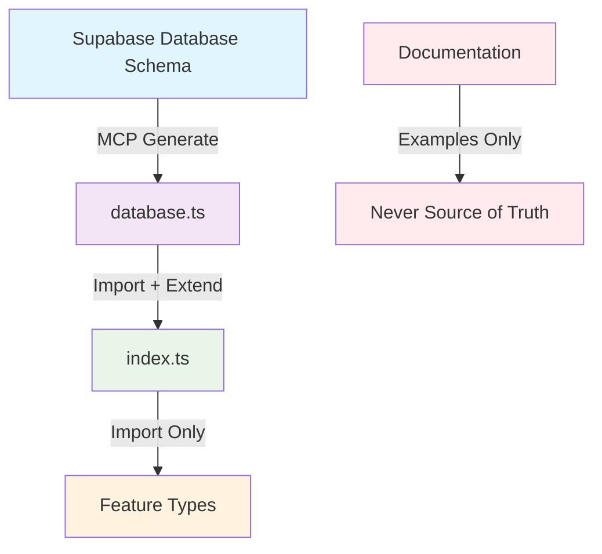

# Type Governance - Smaragdus Viridi

## 🚨 CRITICAL: Preventing Type Duplication Disasters

This document establishes **mandatory** rules to prevent the type duplication catastrophe that occurred during Sprint 3 development.

## 📋 The Problem We Solved

**Before**: We had types defined in **5+ locations** with no single source of truth:

- `.cursor/rules/typescript-standards.mdc` (documentation examples)
- `docs/04-implementation/implementation-playbook.md` (legacy examples)
- `docs/99-archive/legacy/IMPLEMENTATION_SETUP_GUIDE.md` (outdated)
- `src/shared/types/database.ts` (generated + manual duplicates)
- `src/shared/types/index.ts` (hand-written duplicates)

**Result**: Type drift, confusion, bugs, and maintenance nightmare.

## ✅ The Solution: Type Hierarchy



## 🛡️ Mandatory Rules

### Rule 1: Single Source of Truth

**The Supabase database schema is the ONLY source of truth for core types.**

```sql
-- ✅ ONLY place to define core enums
CREATE TYPE gemstone_type AS ENUM ('diamond', 'emerald', 'ruby', 'sapphire');
CREATE TYPE gem_color AS ENUM ('red', 'blue', 'green', 'yellow');
```

### Rule 2: Never Edit Generated Types

**`src/shared/types/database.ts` is auto-generated. NEVER edit manually.**

```typescript
// ✅ Generated via MCP - DO NOT TOUCH
export type Database = {
  public: {
    Enums: {
      gemstone_type: "diamond" | "emerald" | "ruby" | "sapphire";
    };
  };
};
```

### Rule 3: Import, Don't Duplicate

**Always import types from `@/shared/types`. Never redefine.**

```typescript
// ✅ CORRECT
import type { GemstoneType, GemColor } from "@/shared/types";

// ❌ FORBIDDEN - Will break the build
export type GemstoneType = "diamond" | "emerald"; // NEVER DO THIS!
```

### Rule 4: Extend, Don't Replace

**Enhance database types with business logic, don't replace them.**

```typescript
// ✅ CORRECT - Extend database types
export interface Gemstone extends DatabaseGemstone {
  readonly computed_price_per_carat: Money;
  readonly availability_status: AvailabilityStatus;
}

// ❌ FORBIDDEN - Creates parallel hierarchy
export interface MyGemstone {
  name: string;
  color: string;
}
```

## 🔄 Type Sync Workflow

### When Database Schema Changes:

1. **Update Supabase Schema** (via MCP or SQL)

   ```sql
   ALTER TYPE gemstone_type ADD VALUE 'tanzanite';
   ```

2. **Regenerate Types** (via MCP)

   ```typescript
   // Use MCP tool: mcp_supabase_generate_typescript_types
   ```

3. **Verify Propagation** (automatic)

   ```typescript
   // All imports automatically get new types
   import type { GemstoneType } from "@/shared/types";
   // Now includes 'tanzanite'
   ```

4. **Test Build** (mandatory)
   ```bash
   npm run build
   npm run type-check
   ```

## 📁 File Organization

### ✅ Allowed Type Locations:

```
src/shared/types/
├── database.ts          # Generated Supabase types (READ-ONLY)
├── index.ts            # Application extensions (Import + Extend)
└── README.md           # This governance document

src/features/*/types/
└── *.types.ts          # Feature-specific (Import from @/shared/types)
```

### ❌ Forbidden Type Locations:

```
docs/                   # Documentation only - not source of truth
.cursor/rules/          # Examples only - not source of truth
*.md files              # Examples only - not source of truth
```

## 🚫 Enforcement Mechanisms

### 1. ESLint Rules

```javascript
// .eslintrc.js
rules: {
  'no-duplicate-types': 'error',
  'import-from-shared-types': 'error'
}
```

### 2. Pre-commit Hooks

```bash
# Check for type duplications before commit
npm run type-check
npm run lint-types
```

### 3. CI/CD Checks

```yaml
# GitHub Actions
- name: Verify Type Integrity
  run: |
    npm run build
    npm run check-type-duplicates
```

### 4. Code Review Checklist

- [ ] All type imports come from `@/shared/types`
- [ ] No manual enum definitions
- [ ] No type duplications
- [ ] Database types regenerated if schema changed

## 🎯 Team Guidelines

### For Developers:

1. **Always check** `@/shared/types` before creating new types
2. **Never copy-paste** type definitions
3. **Ask before** creating parallel type hierarchies
4. **Regenerate** database types after schema changes

### For Code Reviewers:

1. **Flag** any manual type definitions
2. **Verify** imports come from shared types
3. **Check** for type duplications across files
4. **Ensure** database types are up-to-date

### For DevOps:

1. **Monitor** build failures related to types
2. **Enforce** type checks in CI/CD
3. **Alert** on type inconsistencies
4. **Backup** type generation process

## 🚨 Emergency Procedures

### If Type Duplication is Found:

1. **Stop Development** - Fix immediately
2. **Identify Source** - Find all duplicated definitions
3. **Consolidate** - Move to proper location in hierarchy
4. **Update Imports** - Fix all references
5. **Test Thoroughly** - Ensure no breaking changes
6. **Document** - Update this governance doc if needed

### If Database Types are Out of Sync:

1. **Regenerate** via MCP tools
2. **Check Compilation** - Fix any breaking changes
3. **Update Extensions** - Modify `index.ts` if needed
4. **Test Features** - Ensure all functionality works
5. **Deploy** - Update production types

## 📊 Success Metrics

- **Zero** type duplications across codebase
- **100%** of types imported from `@/shared/types`
- **Automated** type generation from database
- **Consistent** type usage across features
- **Fast** development with reliable type safety

## 🔗 Related Documents

- [TypeScript Standards](.cursor/rules/typescript-standards.mdc)
- [Database Schema](../database/schema.md)
- [MCP Integration Guide](./mcp-integration.md)
- [Code Review Guidelines](./code-review.md)

---

**Remember: Types are the foundation of our application. Keep them clean, consistent, and centralized!** 🎯
