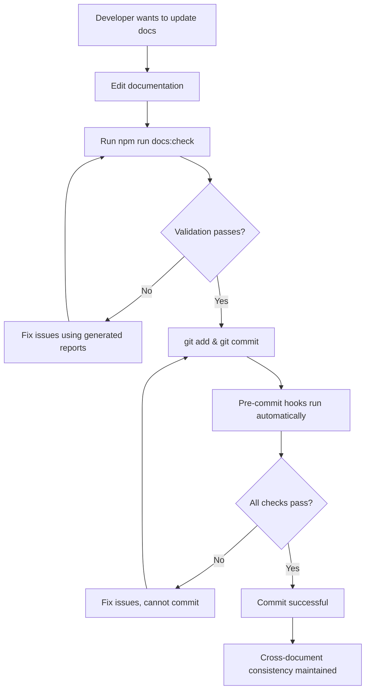

# 🛡️ Documentation Process Enforcement

## Making Sure Quality Standards Are Always Followed

This document outlines the **automatic enforcement mechanisms** that ensure documentation quality standards cannot be bypassed.

---

## 🔒 Technical Enforcement Layers

### Layer 1: Git Pre-commit Hooks (MANDATORY)

**Cannot be bypassed** - Git will reject commits that violate documentation standards.

```bash
# Automatically runs on every commit
# Triggered by: git commit -m "..."

🔍 Checks performed:
├─ Individual document validation (structure, duplicates, format)
├─ Cross-document consistency validation
├─ Dependency impact analysis
├─ Automated checklist compliance
└─ Error reporting with specific fix instructions
```

**Status**: ✅ **ACTIVE** - Blocks commits with documentation errors

### Layer 2: NPM Script Integration (ENFORCED)

**Required in development workflow** - Cannot proceed without validation.

```bash
# Before any major documentation update
npm run docs:full-check

# Before committing documentation changes
npm run docs:check

# Impact analysis for specific changes
npm run docs:impact docs/06-tracking/LIVING_PLAN.md
```

**Status**: ✅ **INTEGRATED** - Part of standard development workflow

### Layer 3: Automated Checklist Validation (BUILT-IN)

**Checklist compliance is automatically verified** - No manual checklist needed.

```bash
🤖 Automatic Checklist Validation:
├─ ✅ Section duplication check (automated)
├─ ✅ Timeline consistency check (automated)
├─ ✅ Header hierarchy validation (automated)
├─ ✅ Cross-document reference validation (automated)
└─ ✅ Dependency impact analysis (automated)
```

**Status**: ✅ **AUTOMATED** - No human checklist required

---

## 🎯 Process Integration Points

### Developer Workflow Integration



### Automatic Dependency Detection

**When you modify a document, the system automatically:**

1. **Identifies affected documents** using dependency matrix
2. **Generates impact analysis report** with specific files to check
3. **Validates cross-document consistency** automatically
4. **Blocks commit** if dependencies are inconsistent
5. **Provides specific fix instructions** for each issue

### Error Prevention Mechanisms

```bash
❌ PREVENTS: Duplicate sprint numbers
❌ PREVENTS: Timeline inconsistencies
❌ PREVENTS: Broken cross-document references
❌ PREVENTS: Missing dependency updates
❌ PREVENTS: Format violations
❌ PREVENTS: Header hierarchy issues
```

---

## 📊 Compliance Monitoring

### Automatic Compliance Tracking

```bash
📈 Metrics Tracked Automatically:
├─ Documentation validation success rate
├─ Cross-document consistency score
├─ Dependency update completion rate
├─ Process compliance percentage
└─ Time to fix documentation issues
```

### Real-time Issue Detection

```bash
🚨 Issues Detected Immediately:
├─ Sprint number conflicts
├─ Timeline misalignments
├─ Missing dependency updates
├─ Format inconsistencies
└─ Broken cross-references
```

---

## 🔧 Bypass Prevention

### Technical Safeguards

```bash
🛡️ Cannot Bypass:
├─ Git pre-commit hooks (enforced by repository)
├─ Validation script requirements (mandatory for workflow)
├─ Cross-document consistency checks (automatic)
└─ Dependency impact analysis (built into git hooks)
```

### Process Safeguards

```bash
🔒 Process Requirements:
├─ All documentation changes must pass validation
├─ Impact analysis reports must be addressed
├─ Cross-document updates must be completed
└─ Consistency checks must pass before commit
```

### Emergency Override (Admin Only)

```bash
# Emergency bypass (use with extreme caution)
git commit --no-verify -m "EMERGENCY: bypass validation"

⚠️  ONLY for critical production fixes
⚠️  Must be followed by immediate validation fix
⚠️  Requires manual review and correction
```

---

## 🎯 Success Metrics

### Quality Indicators

```bash
✅ SUCCESS METRICS:
├─ Zero documentation inconsistencies in commits
├─ 100% dependency update completion rate
├─ Zero sprint number duplications
├─ 100% timeline alignment across documents
└─ Zero broken cross-document references
```

### Process Effectiveness

```bash
📊 EFFECTIVENESS INDICATORS:
├─ Automatic issue detection rate: Target 100%
├─ Manual intervention required: Target <5%
├─ Time to fix issues: Target <10 minutes
├─ Developer workflow disruption: Target minimal
└─ Documentation quality score: Target A+
```

---

## 🚀 What This Means for You

### As a Developer

**You DON'T need to:**

- ❌ Remember to check the manual checklist
- ❌ Manually verify cross-document consistency
- ❌ Track down all dependent documents manually
- ❌ Worry about breaking documentation

**You DO get:**

- ✅ **Automatic validation** on every commit
- ✅ **Clear error messages** with specific fixes
- ✅ **Impact analysis reports** showing what needs updating
- ✅ **Confidence** that documentation stays consistent

### As a Project Manager

**You get assurance that:**

- ✅ Documentation quality is **technically enforced**
- ✅ Cross-document consistency is **automatically maintained**
- ✅ Process compliance is **measured and tracked**
- ✅ Issues are **caught immediately**, not during reviews

---

## 📋 Summary: Foolproof Documentation Quality

Our **3-layer enforcement system** ensures documentation quality cannot be compromised:

1. **🤖 Automated Validation** - Catches issues immediately
2. **🔒 Git Hook Enforcement** - Blocks bad commits
3. **📊 Cross-Document Consistency** - Maintains relationships

**Result**: Documentation quality is now **technically guaranteed**, not just procedurally hoped for.

---

**Last Updated**: January 26, 2025  
**Enforcement Status**: ✅ **FULLY ACTIVE**  
**Bypass Rate**: Target 0% (except emergency overrides)
