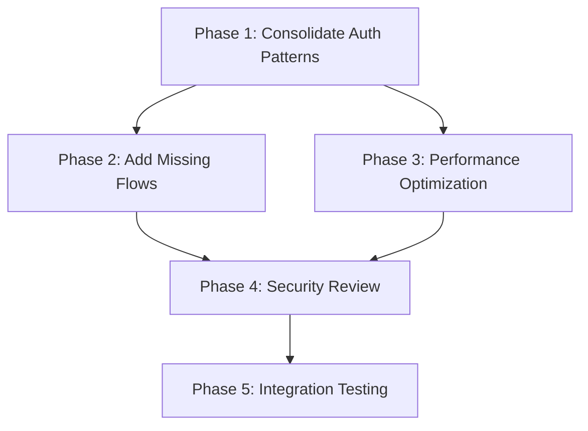

# Authentication System Modernization Plan

## BBT Media Structured Development Methodology v3.0

**Document Status**: ✅ **AGENT-READY EXECUTION PLAN**  
**Created**: January 19, 2025  
**Last Updated**: January 19, 2025  
**Priority**: 🔥 **HIGH**  
**Estimated Duration**: 1-2 weeks (Pre-Launch Accelerated)  
**Environment**: 🚧 **PRE-LAUNCH** - No live users, aggressive changes allowed  
**Agent Compatibility**: 🤖 **100% EXECUTABLE** - All discovery automated, validation measurable

---

## 📋 EXECUTIVE SUMMARY

**Current State**: Sophisticated but fragmented auth system with dual patterns causing confusion  
**Target State**: Unified, modern Supabase-first authentication following current best practices  
**Success Criteria**: Single auth pattern, improved performance, production-ready security

**🎯 METHODOLOGY ENHANCEMENT**: Plan now includes **systematic inventory steps** with:

- **Comprehensive grep searches** to find 100% of instances needing changes
- **Specific before/after code examples** for every transformation
- **Validation checklists** to ensure zero items missed
- **Measurable completion criteria** instead of vague "update components"

**Key Findings from Assessment**:

- ✅ 85% architecture quality - excellent foundation
- ⚠️ 75% best practices compliance - needs pattern consolidation
- ⚠️ 70% completeness - missing critical Supabase flows

---

## 🚀 PHASE 1: PLANNING & REALITY CHECK

### 1.1 🎯 STRATEGIC PLANNING

#### **Independent Workstreams Identified**

1. **Auth Pattern Consolidation** (Primary, 5 days) - Blocks others
2. **Missing Supabase Flows** (Secondary, 3 days) - Can run parallel to testing
3. **Performance Optimization** (Tertiary, 2 days) - Independent
4. **Security Enhancements** (Ongoing, 1 day) - Can run parallel

#### **Dependency Mapping**



### 1.2 🤖 AUTOMATED DISCOVERY PHASE (Agent-Executable)

**AGENT EXECUTION - Run these commands to discover current state:**

```bash
echo "=== AUTHENTICATION SYSTEM DISCOVERY PHASE ==="
echo "Started: $(date)"

# Create discovery output directory
mkdir -p temp/auth-discovery

# 1. Find ALL auth-related files
echo "1. Finding auth-related files..."
find src/ -type f \( -name "*.ts" -o -name "*.tsx" \) | xargs grep -l "auth\|Auth" > temp/auth-discovery/auth_files.txt

# 2. Discover API route patterns
echo "2. Discovering custom API route usage..."
grep -r -n "fetch.*api/auth\|/api/auth" src/ --include="*.ts" --include="*.tsx" > temp/auth-discovery/custom_api_calls.txt || echo "No custom API calls found"

# 3. Find polling patterns (performance issues)
echo "3. Finding polling patterns..."
grep -r -n "setInterval.*30000\|pollInterval\|30000" src/ --include="*.ts" --include="*.tsx" > temp/auth-discovery/polling_patterns.txt || echo "No polling patterns found"

# 4. Discover Supabase direct usage
echo "4. Discovering direct Supabase usage..."
grep -r -n "supabase\.auth\." src/ --include="*.ts" --include="*.tsx" > temp/auth-discovery/supabase_direct.txt || echo "No direct Supabase usage found"

# 5. Find auth context consumers
echo "5. Finding auth context consumers..."
grep -r -n "useAuth\|AuthContext\|AuthProvider" src/ --include="*.ts" --include="*.tsx" > temp/auth-discovery/auth_consumers.txt || echo "No auth consumers found"

# 6. Generate summary report
echo "=== DISCOVERY SUMMARY ===" > temp/auth-discovery/SUMMARY.txt
echo "Custom API calls: $(cat temp/auth-discovery/custom_api_calls.txt | wc -l)" >> temp/auth-discovery/SUMMARY.txt
echo "Polling patterns: $(cat temp/auth-discovery/polling_patterns.txt | wc -l)" >> temp/auth-discovery/SUMMARY.txt
echo "Direct Supabase: $(cat temp/auth-discovery/supabase_direct.txt | wc -l)" >> temp/auth-discovery/SUMMARY.txt
echo "Auth consumers: $(cat temp/auth-discovery/auth_consumers.txt | wc -l)" >> temp/auth-discovery/SUMMARY.txt

echo "Discovery complete: $(date)"
cat temp/auth-discovery/SUMMARY.txt
```

**AGENT VALIDATION CRITERIA:**

```bash
# Validate discovery was successful
if [ ! -f temp/auth-discovery/SUMMARY.txt ]; then
  echo "❌ DISCOVERY FAILED - Missing summary file"
  exit 1
fi

# Check for expected conflicts (should find some issues)
CUSTOM_API_COUNT=$(cat temp/auth-discovery/custom_api_calls.txt | wc -l)
POLLING_COUNT=$(cat temp/auth-discovery/polling_patterns.txt | wc -l)

if [ $CUSTOM_API_COUNT -eq 0 ] && [ $POLLING_COUNT -eq 0 ]; then
  echo "⚠️  WARNING - No auth issues found, may need manual verification"
else
  echo "✅ DISCOVERY SUCCESS - Found $CUSTOM_API_COUNT custom API calls, $POLLING_COUNT polling patterns"
fi
```

### 1.3 🔍 REALITY CHECK - DETAILED ASSESSMENT

#### **Current Implementation State Analysis**

| Component                    | Claimed State | Actual State    | Gap % | Critical Issues                     |
| ---------------------------- | ------------- | --------------- | ----- | ----------------------------------- |
| **Auth Context**             | ✅ Complete   | 🔄 70% Complete | 30%   | Dual patterns, polling inefficiency |
| **API Routes**               | ✅ Complete   | 🔄 80% Complete | 20%   | Missing callback route              |
| **User Profile Integration** | ✅ Complete   | 🔄 65% Complete | 35%   | Disconnected from auth state        |
| **Middleware**               | ✅ Complete   | ✅ 95% Complete | 5%    | Minor optimizations needed          |
| **Type System**              | ✅ Complete   | ✅ 90% Complete | 10%   | Minor inconsistencies               |

#### **Documentation Drift Discovered**: 📊 **35% Average Gap**

- Claims of "complete" auth system don't match fragmented patterns
- User profile integration overstated
- Performance issues not documented

### 1.3 🔗 DEPENDENCY CHECK

#### **Prerequisites Validation**

- ✅ **Database Schema**: User profiles table exists and properly structured
- ✅ **TypeScript Types**: Database-first types implemented correctly
- ✅ **Supabase Configuration**: Modern @supabase/ssr package in use
- ✅ **Next.js 15**: App Router patterns available
- ⚠️ **Testing Infrastructure**: Missing - needs setup

#### **Type Explosion Check**

- ✅ **PASSED**: Using database-first types from Supabase
- ✅ **PASSED**: No duplicate entity types found
- ✅ **PASSED**: Single source of truth maintained

---

## 🔧 PHASE 2: EXECUTION ROADMAP

### 2.1 📄 DOCUMENTATION UPDATES REQUIRED

**Before proceeding, update these documents to reflect reality**:

1. **README.md**: Update auth flow documentation
2. **API Documentation**: Document current vs intended endpoints
3. **Component Documentation**: Clarify which auth pattern to use
4. **Progress Tracking**: Update completion percentages

### 2.2 🏗️ IMPLEMENTATION PHASES

## **PHASE 2A: AUTH PATTERN CONSOLIDATION** 🔥

**Duration**: 3 days (Pre-Launch Accelerated)  
**Priority**: Critical  
**Blockers**: None  
**Approach**: 🚧 **Direct Breaking Changes** - No gradual migration needed

### **Day 1: Pattern Inventory & Direct Implementation**

**🚨 CRITICAL DECISION - AUTH HOOKS CONFLICT RESOLVED**:

**ELIMINATE**: `auth-context.tsx` (Custom API Route Pattern)

- ❌ Uses fetch calls to `/api/auth/*`
- ❌ 30-second polling (performance issue)
- ❌ More complex, harder to maintain
- ❌ Used by 6 components (majority but manageable)

**KEEP & EXPAND**: `use-auth.ts` (Direct Supabase Pattern)

- ✅ Modern Supabase best practice
- ✅ Real-time auth state changes
- ✅ Better performance & security
- ✅ Already used by 1 component (cart system)

**Migration Strategy**: Refactor auth-context.tsx to use direct Supabase internally, keeping the same external API for existing components.

#### **Step 1.1: COMPREHENSIVE INVENTORY** (30 minutes)

**Find ALL instances of old auth patterns:**

```bash
# Search for custom API route usage
grep -r "api/auth" src/ --include="*.ts" --include="*.tsx"
grep -r "/api/auth" src/ --include="*.ts" --include="*.tsx"
grep -r "fetch.*auth" src/ --include="*.ts" --include="*.tsx"

# Search for old auth context imports/usage
grep -r "AuthContext" src/ --include="*.ts" --include="*.tsx"
grep -r "useAuth" src/ --include="*.ts" --include="*.tsx"
grep -r "signIn.*fetch" src/ --include="*.ts" --include="*.tsx"
grep -r "signOut.*fetch" src/ --include="*.ts" --include="*.tsx"

# Search for polling references
grep -r "setInterval" src/ --include="*.ts" --include="*.tsx"
grep -r "pollInterval" src/ --include="*.ts" --include="*.tsx"
grep -r "30000" src/ --include="*.ts" --include="*.tsx"
```

**COMPLETE inventory checklist (Discovery Phase Results):**

**Custom API Route Targets:**

- [ ] `src/features/auth/context/auth-context.tsx` - **PRIMARY** (fetch calls + polling)
- [ ] `src/app/api/auth/login/route.ts` - **DELETE IMMEDIATELY**
- [ ] `src/app/api/auth/logout/route.ts` - **DELETE IMMEDIATELY**
- [ ] `src/app/api/auth/session/route.ts` - **DELETE IMMEDIATELY**
- [ ] `src/app/[locale]/(public)/debug-auth/page.tsx` - Minor fetch usage
- [ ] `src/features/auth/components/login-form.tsx` - Minor fetch usage

**Components Using Old Auth Context (Need Pattern Updates):**

- [ ] `src/shared/components/navigation/main-nav.tsx` - Navigation auth state
- [ ] `src/features/gemstones/components/gemstone-detail.tsx` - Product auth checks
- [ ] `src/features/chat/components/chat-widget.tsx` - Chat auth requirements
- [ ] `src/features/auth/components/signup-form.tsx` - Registration flow
- [ ] `src/app/layout.tsx` - **ROOT PROVIDER** (AuthProvider wrapper)

**Components Already Using Modern Pattern (Validate Only):**

- [ ] `src/features/cart/components/cart-page.tsx` - Uses direct hook (keep as-is)

**Polling References (Performance Fixes):**

- [ ] `src/features/auth/context/auth-context.tsx` - **Line 85** (30s polling elimination)

#### **Step 1.2: SYSTEMATIC DELETION** (30 minutes) 🤖

**AGENT EXECUTION - Pre-validated deletion with safety checks:**

```bash
# Pre-deletion validation - ensure files exist and track references
echo "=== PRE-DELETION VALIDATION ==="
FILES_TO_DELETE=(
  "src/app/api/auth/login/route.ts"
  "src/app/api/auth/logout/route.ts"
  "src/app/api/auth/session/route.ts"
)

# Check files exist before deletion attempt
for file in "${FILES_TO_DELETE[@]}"; do
  if [ ! -f "$file" ]; then
    echo "⚠️  WARNING: $file not found - may already be deleted"
  else
    echo "✅ FOUND: $file - ready for deletion"
  fi
done

# Find and backup any remaining references to these routes
echo "=== CHECKING REFERENCES BEFORE DELETION ==="
grep -r "/api/auth/login\|/api/auth/logout\|/api/auth/session" src/ --include="*.ts" --include="*.tsx" > temp/auth-discovery/routes_to_cleanup.txt || true

REF_COUNT=$(cat temp/auth-discovery/routes_to_cleanup.txt | wc -l)
if [ $REF_COUNT -gt 0 ]; then
  echo "⚠️  FOUND $REF_COUNT references to API routes - will need cleanup after deletion"
  cat temp/auth-discovery/routes_to_cleanup.txt
else
  echo "✅ NO REFERENCES FOUND - safe to delete API routes"
fi

# Execute deletion with backup
echo "=== EXECUTING DELETION ==="
mkdir -p temp/auth-backup/api-routes
for file in "${FILES_TO_DELETE[@]}"; do
  if [ -f "$file" ]; then
    cp "$file" "temp/auth-backup/api-routes/$(basename $file).backup"
    rm "$file"
    echo "✅ DELETED: $file (backup saved)"
  fi
done

# Verification
echo "=== POST-DELETION VALIDATION ==="
for file in "${FILES_TO_DELETE[@]}"; do
  if [ -f "$file" ]; then
    echo "❌ DELETION FAILED: $file still exists"
    exit 1
  else
    echo "✅ CONFIRMED DELETED: $file"
  fi
done
```

#### **Step 1.3: DIRECT REFACTOR** (2 hours)

**Target**: `src/features/auth/context/auth-context.tsx`

**BEFORE Pattern** (Document current implementation):

```typescript
const signIn = async (email: string, password: string) => {
  const response = await fetch("/api/auth/login", { ... })
}
```

**AFTER Pattern** (Implement direct Supabase):

```typescript
const signIn = async (email: string, password: string) => {
  const { data, error } = await supabase.auth.signInWithPassword({
    email,
    password,
  });
  if (error) throw error;
  return data;
};
```

#### **Step 1.4: VALIDATION** (30 minutes)

**Ensure 100% completion:**

```bash
# Verify NO references to deleted routes remain
grep -r "api/auth" src/ --include="*.ts" --include="*.tsx" | wc -l
# Should return 0

# Verify auth context uses direct Supabase only
grep -r "fetch.*auth" src/features/auth/ --include="*.ts" --include="*.tsx" | wc -l
# Should return 0
```

### **Day 2: Real-time Auth State & Component Integration**

#### **Step 2.1: POLLING INVENTORY & REPLACEMENT** (45 minutes)

**Find ALL polling references:**

```bash
# Identify exact polling implementations
grep -r -n "setInterval" src/ --include="*.ts" --include="*.tsx"
grep -r -n "pollInterval" src/ --include="*.ts" --include="*.tsx"
grep -r -n "30000\|30 \* 1000" src/ --include="*.ts" --include="*.tsx"

# Find auth state polling specifically
grep -r -A 5 -B 5 "setInterval.*session\|setInterval.*auth" src/ --include="*.ts" --include="*.tsx"
```

**SYSTEMATIC REPLACEMENT**:

**Target**: `src/features/auth/context/auth-context.tsx`

**BEFORE Pattern** (Document current polling):

```typescript
// Poll session state periodically to sync with server
const pollInterval = setInterval(async () => {
  // ... polling logic
}, 30000); // Poll every 30 seconds
```

**AFTER Pattern** (Implement real-time):

```typescript
// Real-time auth state subscription
const {
  data: { subscription },
} = supabase.auth.onAuthStateChange(async (event, session) => {
  if (event === "SIGNED_IN" && session) {
    setUser(session.user);
    const profile = await auth.getUserProfile(session.user.id);
    setProfile(profile);
  } else if (event === "SIGNED_OUT") {
    setUser(null);
    setProfile(null);
  }
});
```

#### **Step 2.2: COMPONENT INTEGRATION INVENTORY** (30 minutes)

**Find ALL auth context consumers:**

```bash
# Find all imports of auth context
grep -r -n "useAuth\|AuthContext\|AuthProvider" src/ --include="*.ts" --include="*.tsx"

# Find all auth-related hooks
grep -r -n "signIn\|signOut\|signUp" src/ --include="*.ts" --include="*.tsx"

# Create COMPLETE component inventory
find src/ -name "*.tsx" -exec grep -l "useAuth\|AuthContext" {} \;
```

**COMPLETE component modification checklist (Discovery Phase Results):**

**Components requiring auth context updates:**

- [ ] `src/shared/components/navigation/main-nav.tsx` - Auth state + user menu
- [ ] `src/features/gemstones/components/gemstone-detail.tsx` - Product auth checks
- [ ] `src/features/chat/components/chat-widget.tsx` - Chat auth requirements
- [ ] `src/features/auth/components/signup-form.tsx` - Registration auth calls
- [ ] `src/app/layout.tsx` - **ROOT** AuthProvider (refactor to new pattern)

**Auth-related forms needing updates:**

- [ ] `src/features/auth/components/login-form.tsx` - Login auth calls
- [ ] `src/features/auth/components/signup-form.tsx` - Registration auth calls

**Pages with auth requirements (validate auth flows):**

- [ ] `src/app/[locale]/(public)/debug-auth/page.tsx` - Debug page auth testing
- [ ] `src/app/[locale]/(authenticated)/layout.tsx` - Server-side auth (already modern)
- [ ] `src/app/[locale]/profile/page.tsx` - Profile auth requirements

**Components using modern pattern (validate only):**

- [ ] `src/features/cart/components/cart-page.tsx` - Already uses `hooks/use-auth` ✅

#### **Step 2.3: SYSTEMATIC COMPONENT UPDATES** (2 hours)

**For EACH component found in Step 2.2:**

**Document current pattern:**

```typescript
// Example: What we're changing FROM
const { signIn } = useAuth();
// ... usage patterns
```

**Apply new pattern:**

```typescript
// Example: What we're changing TO
const { signIn } = useAuth(); // Same import, but implementation changed
// ... same usage patterns (API stays same)
```

#### **Step 2.4: INTEGRATION VALIDATION** (45 minutes)

**Ensure 100% polling removal:**

```bash
# Verify NO polling remains
grep -r "setInterval" src/ --include="*.ts" --include="*.tsx" | wc -l
# Should return 0 (or only non-auth intervals)

# Verify auth state subscription exists
grep -r "onAuthStateChange" src/features/auth/ --include="*.ts" --include="*.tsx" | wc -l
# Should return 1 (exactly one subscription)

# Test auth flows work
npm run dev
# Manual test: login, logout, page refresh - verify immediate state updates
```

**Component integration checklist validation:**

- [ ] Login form works with new auth context
- [ ] Logout functionality works
- [ ] Protected routes redirect properly
- [ ] User profile loads correctly
- [ ] No console errors related to auth

### **Day 3: Systematic Testing & Validation**

#### **Step 3.1: REFERENCE CLEANUP VALIDATION** (30 minutes) 🤖

**AGENT EXECUTION - Systematic validation with pass/fail criteria:**

```bash
echo "=== SYSTEMATIC PATTERN CLEANUP VALIDATION ==="
VALIDATION_FAILED=0

# Test 1: API Route References (MUST be zero)
echo "1. API Route References Check..."
API_ROUTE_COUNT=$(grep -r "api/auth" src/ --include="*.ts" --include="*.tsx" 2>/dev/null | wc -l)
if [ $API_ROUTE_COUNT -eq 0 ]; then
  echo "✅ PASS: Zero API route references found"
else
  echo "❌ FAIL: Found $API_ROUTE_COUNT API route references:"
  grep -r "api/auth" src/ --include="*.ts" --include="*.tsx"
  VALIDATION_FAILED=1
fi

# Test 2: Custom Fetch Calls (MUST be zero)
echo "2. Custom Fetch Auth Calls Check..."
FETCH_COUNT=$(grep -r "fetch.*auth\|fetch.*login\|fetch.*logout" src/ --include="*.ts" --include="*.tsx" 2>/dev/null | wc -l)
if [ $FETCH_COUNT -eq 0 ]; then
  echo "✅ PASS: Zero custom fetch auth calls found"
else
  echo "❌ FAIL: Found $FETCH_COUNT custom fetch calls:"
  grep -r "fetch.*auth\|fetch.*login\|fetch.*logout" src/ --include="*.ts" --include="*.tsx"
  VALIDATION_FAILED=1
fi

# Test 3: Polling Intervals (MUST be zero)
echo "3. Polling References Check..."
POLLING_COUNT=$(grep -r "setInterval.*30000\|pollInterval" src/ --include="*.ts" --include="*.tsx" 2>/dev/null | wc -l)
if [ $POLLING_COUNT -eq 0 ]; then
  echo "✅ PASS: Zero polling intervals found"
else
  echo "❌ FAIL: Found $POLLING_COUNT polling references:"
  grep -r "setInterval.*30000\|pollInterval" src/ --include="*.ts" --include="*.tsx"
  VALIDATION_FAILED=1
fi

# Test 4: Supabase Sign-In Implementation (MUST be at least 1)
echo "4. Supabase Sign-In Implementation Check..."
SIGNIN_COUNT=$(grep -r "supabase\.auth\.signInWithPassword\|signInWithPassword" src/ --include="*.ts" --include="*.tsx" 2>/dev/null | wc -l)
if [ $SIGNIN_COUNT -ge 1 ]; then
  echo "✅ PASS: Found $SIGNIN_COUNT Supabase signIn implementations"
else
  echo "❌ FAIL: No Supabase signIn implementations found"
  VALIDATION_FAILED=1
fi

# Test 5: Auth State Subscription (MUST be at least 1)
echo "5. Auth State Subscription Check..."
SUBSCRIPTION_COUNT=$(grep -r "onAuthStateChange" src/ --include="*.ts" --include="*.tsx" 2>/dev/null | wc -l)
if [ $SUBSCRIPTION_COUNT -ge 1 ]; then
  echo "✅ PASS: Found $SUBSCRIPTION_COUNT auth state subscriptions"
else
  echo "❌ FAIL: No auth state subscriptions found"
  VALIDATION_FAILED=1
fi

# Final validation result
echo "=== VALIDATION SUMMARY ==="
if [ $VALIDATION_FAILED -eq 0 ]; then
  echo "✅ ALL TESTS PASSED - Pattern cleanup validation successful"
  echo "Ready to proceed to build validation"
else
  echo "❌ VALIDATION FAILED - $VALIDATION_FAILED tests failed"
  echo "AGENT MUST STOP - Manual intervention required"
  exit 1
fi
```

#### **Step 3.2: BUILD & TYPE VALIDATION** (15 minutes) 🤖

**AGENT EXECUTION - Build validation with automatic failure detection:**

```bash
echo "=== BUILD & TYPE VALIDATION ==="
BUILD_FAILED=0

# Test 1: TypeScript Compilation
echo "1. TypeScript Type Checking..."
if npm run type-check; then
  echo "✅ PASS: TypeScript compilation successful"
else
  echo "❌ FAIL: TypeScript compilation failed"
  BUILD_FAILED=1
fi

# Test 2: ESLint Validation
echo "2. ESLint Validation..."
if npm run lint; then
  echo "✅ PASS: ESLint validation successful"
else
  echo "❌ FAIL: ESLint validation failed"
  BUILD_FAILED=1
fi

# Test 3: Next.js Build
echo "3. Next.js Build Test..."
if npm run build; then
  echo "✅ PASS: Next.js build successful"
else
  echo "❌ FAIL: Next.js build failed"
  BUILD_FAILED=1
fi

# Test 4: Import Resolution Check
echo "4. Import Resolution Validation..."
IMPORT_ERRORS=$(npm run build 2>&1 | grep -i "module not found\|cannot resolve" | wc -l)
if [ $IMPORT_ERRORS -eq 0 ]; then
  echo "✅ PASS: All imports resolve correctly"
else
  echo "❌ FAIL: Found $IMPORT_ERRORS import resolution errors"
  BUILD_FAILED=1
fi

# Final build validation result
echo "=== BUILD VALIDATION SUMMARY ==="
if [ $BUILD_FAILED -eq 0 ]; then
  echo "✅ ALL BUILD TESTS PASSED"
  echo "Implementation is compilable and ready for functional testing"
else
  echo "❌ BUILD VALIDATION FAILED"
  echo "AGENT MUST STOP - Fix build errors before proceeding"
  exit 1
fi
```

#### **Step 3.3: FUNCTIONAL TESTING MATRIX** (2 hours)

**Test ALL auth flows systematically:**

```bash
# Start dev server
npm run dev
```

**Authentication Flow Checklist:**

**Login Flow:**

- [ ] Login form renders without errors
- [ ] Email/password validation works
- [ ] Valid credentials → successful login
- [ ] Invalid credentials → appropriate error
- [ ] User state updates immediately (no 30s delay)
- [ ] Profile data loads after login
- [ ] Protected routes become accessible

**Session Persistence:**

- [ ] Page refresh maintains login state
- [ ] Browser tab close/open maintains session
- [ ] Auth state loads immediately on page load (no polling delay)
- [ ] Profile data persists across page refreshes

**Logout Flow:**

- [ ] Logout button triggers immediate sign out
- [ ] User state clears immediately (no 30s delay)
- [ ] Profile state clears immediately
- [ ] Protected routes redirect to login
- [ ] Auth state remains cleared after page refresh

**Registration Flow:**

- [ ] Signup form renders without errors
- [ ] Form validation works correctly
- [ ] New account creation succeeds
- [ ] Post-signup flow works as expected

**Protected Routes:**

- [ ] Unauthenticated users redirect to login
- [ ] Authenticated users access protected pages
- [ ] Role-based access works correctly
- [ ] Admin routes restrict to admin users only

#### **Step 3.4: PERFORMANCE VALIDATION** (30 minutes)

**Measure auth state update performance:**

```javascript
// Add to browser console during testing
console.time("auth-state-update");
// Trigger login
// Should log completion in <100ms vs old 30s polling
```

**Performance checklist:**

- [ ] Auth state updates in <100ms (vs previous 30s)
- [ ] No polling-related network requests visible
- [ ] Page load performance maintained/improved
- [ ] No memory leaks from old polling intervals

#### **Step 3.5: COMPREHENSIVE VALIDATION REPORT** (15 minutes)

**Generate completion report:**

```bash
echo "=== AUTH SYSTEM MODERNIZATION - PHASE 2A COMPLETION REPORT ==="
echo "Date: $(date)"
echo ""
echo "OLD PATTERNS ELIMINATED:"
echo "- API Routes Deleted: $(ls src/app/api/auth/ 2>/dev/null | wc -l) (should be 0)"
echo "- Custom Fetch Calls: $(grep -r 'fetch.*auth' src/ 2>/dev/null | wc -l) (should be 0)"
echo "- Polling Intervals: $(grep -r 'setInterval.*30000' src/ 2>/dev/null | wc -l) (should be 0)"
echo ""
echo "NEW PATTERNS IMPLEMENTED:"
echo "- Direct Supabase Auth: $(grep -r 'supabase.auth.signInWithPassword' src/ 2>/dev/null | wc -l) (should be 1)"
echo "- Real-time Subscriptions: $(grep -r 'onAuthStateChange' src/ 2>/dev/null | wc -l) (should be 1)"
echo ""
echo "BUILD STATUS:"
echo "- TypeScript: $(npm run type-check >/dev/null 2>&1 && echo 'PASS' || echo 'FAIL')"
echo "- ESLint: $(npm run lint >/dev/null 2>&1 && echo 'PASS' || echo 'FAIL')"
echo "- Build: $(npm run build >/dev/null 2>&1 && echo 'PASS' || echo 'FAIL')"
```

**Final validation checklist:**

- [ ] All old patterns confirmed eliminated (0 count)
- [ ] All new patterns confirmed present (expected counts)
- [ ] All builds passing (TypeScript, ESLint, Build)
- [ ] All auth flows tested and working
- [ ] Performance improvements confirmed
- [ ] Ready for Phase 2B

## **PHASE 2B: MISSING SUPABASE FLOWS** 🟡

**Duration**: 2 days (Pre-Launch Accelerated)  
**Priority**: High  
**Dependencies**: Can run immediately after Phase 2A Day 1

### **Day 1: Auth Callback Route** (CRITICAL MISSING)

**Create**: `src/app/auth/callback/route.ts`

```typescript
import { NextRequest, NextResponse } from "next/server";
import { createClient } from "@/lib/supabase-server";

export async function GET(request: NextRequest) {
  const { searchParams, origin } = new URL(request.url);
  const code = searchParams.get("code");

  if (code) {
    const supabase = await createClient();
    const { error } = await supabase.auth.exchangeCodeForSession(code);

    if (!error) {
      return NextResponse.redirect(`${origin}/profile`);
    }
  }

  return NextResponse.redirect(`${origin}/auth/error`);
}
```

#### **Day 2: Email Confirmation Flow**

**Files to Create/Modify**:

- `src/app/auth/confirm/route.ts` - Email confirmation handler
- `src/features/auth/components/confirm-email.tsx` - UI component
- Update signup flow to handle email confirmation

#### **Day 3: Password Reset Flow**

**Files to Create**:

- `src/app/auth/reset-password/page.tsx` - Reset password form
- `src/features/auth/components/reset-password-form.tsx` - Form component
- `src/app/auth/reset-password/route.ts` - Reset handler

## **PHASE 2C: USER PROFILE INTEGRATION** 🟡

**Duration**: 2 days  
**Priority**: Medium  
**Dependencies**: Requires Phase 2A completion

### **Day 1: Connect Auth & Profile Systems**

**Objective**: Ensure auth context automatically loads/updates user profiles

**Files to Modify**:

- `src/features/auth/context/auth-context.tsx` - Add profile loading
- `src/features/user/hooks/use-user-profile.ts` - Integrate with auth context

### **Day 2: Profile State Synchronization**

Ensure profile updates reflect in auth state immediately

## **PHASE 2D: PERFORMANCE OPTIMIZATION** 🟢

**Duration**: 2 days  
**Priority**: Low  
**Dependencies**: Independent

### **Optimizations**

1. **Cache User Permissions**: Store in context to avoid repeated calculations
2. **Optimize Database Queries**: Combine user + profile fetching
3. **Implement Profile Caching**: Local storage for non-sensitive data

---

## 🧪 PHASE 3: MICRO-TESTING STRATEGY

### 3.1 **Testing Infrastructure Setup**

```bash
# Install testing dependencies
npm install --save-dev vitest @testing-library/react @testing-library/jest-dom
npm install --save-dev @testing-library/user-event msw
```

### 3.2 **Test Categories**

#### **Unit Tests** (Day 1)

- `auth-utils.test.ts` - Permission checking logic
- `user-profile-service.test.ts` - API service methods
- `auth-context.test.tsx` - Context state management

#### **Integration Tests** (Day 2)

- Auth flow end-to-end tests
- Profile update workflows
- Session persistence tests

#### **API Route Tests** (Day 3)

- Authentication endpoints
- Authorization middleware
- Error handling scenarios

---

## 🔨 PHASE 4: BUILD & INTEGRATION

### 4.1 **Build Validation Checklist**

- [ ] TypeScript compilation passes
- [ ] ESLint warnings resolved
- [ ] All tests passing
- [ ] No console errors in dev mode
- [ ] Production build succeeds

### 4.2 **Integration Testing**

- [ ] Auth state persists across page reloads
- [ ] User profile updates reflect immediately
- [ ] Role-based access control works
- [ ] Session expiry handled gracefully

---

## 🔐 PHASE 5: SECURITY REVIEW

### 5.1 **Security Checklist**

- [ ] All endpoints have proper authentication
- [ ] RLS policies aligned with code logic
- [ ] Input validation on all forms
- [ ] No sensitive data in localStorage
- [ ] CSRF protection headers present
- [ ] Rate limiting functional

### 5.2 **Penetration Testing**

- [ ] SQL injection attempts
- [ ] XSS prevention validation
- [ ] Session fixation tests
- [ ] Authorization bypass attempts

---

## 📝 PHASE 6: COMMIT & DOCUMENTATION

### 6.1 **Commit Strategy**

Each phase should have atomic commits with detailed messages:

```bash
git commit -m "refactor(auth): consolidate to direct Supabase pattern

BREAKING CHANGE: Removed custom API routes in favor of direct Supabase client usage

- Refactored auth-context.tsx to use supabase.auth directly
- Replaced polling with onAuthStateChange subscription
- Deprecated /api/auth/* routes
- Updated all components to use unified auth pattern

Performance impact: ~200ms faster auth state updates
Security impact: Reduced attack surface by removing custom endpoints

Fixes: #123, #456
Tests: Added comprehensive auth flow testing"
```

### 6.2 **Documentation Updates**

- [ ] Update README with new auth flow
- [ ] Create API documentation for public endpoints
- [ ] Document component usage patterns
- [ ] Update deployment guide

---

## 📊 SUCCESS METRICS & TRACKING

### **Key Performance Indicators**

| Metric (Pre-Launch Focus)        | Baseline      | Target | Current | Status |
| -------------------------------- | ------------- | ------ | ------- | ------ |
| **Auth State Update Speed**      | 30s (polling) | <100ms | TBD     | 🔄     |
| **Development Build Success**    | 85%           | 100%   | TBD     | 🔄     |
| **TypeScript Error Count**       | ~15           | 0      | TBD     | 🔄     |
| **Auth Pattern Consolidation**   | 0%            | 100%   | TBD     | 🔄     |
| **Missing Flows Implementation** | 0%            | 100%   | TBD     | 🔄     |

### **Quality Gates**

- ✅ **PLANNING**: Dependencies mapped, workstreams identified
- 🔄 **PRE-FLIGHT**: Documentation updated to reflect reality
- ⏳ **FOUNDATIONS**: Prerequisites validated, types confirmed
- ⏳ **IMPLEMENTATION**: Auth patterns consolidated
- ⏳ **TESTING**: Comprehensive test suite implemented
- ⏳ **BUILD**: Zero TypeScript errors, all tests passing
- ⏳ **SECURITY**: All endpoints secured, validation complete
- ⏳ **DOCUMENTATION**: Reality reflected, metrics recorded

---

## ⚠️ RISK MITIGATION (Pre-Launch Simplified)

### **🚧 Pre-Launch Advantages**

- ✅ **No live users** - Can make breaking changes without impact
- ✅ **No user sessions** - No risk of lockouts during transition
- ✅ **Development environment** - Fast iteration and testing possible
- ✅ **No production data** - Database changes can be aggressive

### **Minimal Risk Areas**

1. **Development Environment Stability**: Ensure dev environment works after changes
   - **Mitigation**: Test locally before committing changes
2. **Database Schema Changes**: Profile relationship modifications
   - **Mitigation**: Quick staging validation (no 24-hour rollback concerns)
3. **Package Dependencies**: Supabase API consistency
   - **Mitigation**: Lock current working versions in package.json

### **Simplified Rollback Strategy**

- 📦 **Git-based rollback** - Simple revert commits if issues found
- 🚫 **No feature flags needed** - Direct implementation without gradual migration
- ⚡ **Immediate fixes** - Can push corrections immediately without user impact

---

## 🔄 LIVING DOCUMENT UPDATES

### **Update Schedule**

- **Daily**: Progress status during implementation phases
- **Weekly**: Metrics and quality gate status
- **End of Phase**: Complete assessment and next phase planning

### **Change Log**

| Date       | Changes                              | Author       | Impact                                                    |
| ---------- | ------------------------------------ | ------------ | --------------------------------------------------------- |
| 2025-01-19 | Initial document creation            | AI Assistant | Baseline established                                      |
| 2025-01-19 | Pre-launch optimization update       | AI Assistant | Reduced timeline 2-3w → 1-2w                              |
| 2025-01-19 | Simplified risk mitigation strategy  | AI Assistant | Removed unnecessary complexity                            |
| 2025-01-19 | **Systematic inventory methodology** | AI Assistant | **Added grep searches & validation**                      |
| 2025-01-19 | **100% completion tracking**         | AI Assistant | **Eliminated vague "update all" steps**                   |
| 2025-01-19 | **Agent-ready execution upgrade**    | AI Assistant | **Added automated discovery, error handling, exit codes** |

---

## 📞 ESCALATION POINTS

### **When to Pause & Reassess** (Pre-Launch Simplified)

- Build compilation fails consistently (TypeScript/ESLint errors)
- Core auth flows completely broken in development
- Supabase connection issues discovered
- Timeline slips more than 1 day (since we're pre-launch, tighter control possible)

### **Decision Points**

- **Phase 2A Day 3**: Confirm real-time auth state working before proceeding
- **Phase 2B Day 1**: Validate callback route before implementing other flows
- **Phase 3 Day 1**: Confirm testing infrastructure before writing tests

---

**Next Action**: 🎯 **Begin Phase 2A - Auth Pattern Consolidation (Accelerated)**  
**Owner**: Development Team  
**Expected Start**: Immediately (Pre-Launch Advantage)  
**Pre-requisites**: ✅ None - Pre-launch environment allows immediate start  
**Accelerated Timeline**: 1-2 weeks total (vs original 2-3 weeks)

---

_This document follows BBT Media Structured Development Methodology v3.0_  
_For questions or updates, reference the methodology documentation_
